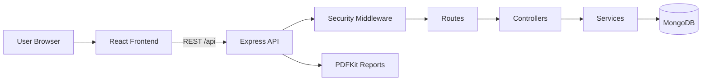

# EcoBuddy AI - Carbon Footprint Awareness Platform

Tagline: **Understand your impact. Reduce your footprint. Save the planet.**

## Project Overview

EcoBuddy AI is a single-user full-stack web application for logging daily activities, calculating carbon emissions, viewing dashboard trends, generating recommendations, setting reduction goals, and downloading PDF reports.

## Problem Statement

Most people lack visibility into how everyday choices contribute to carbon emissions. EcoBuddy AI turns activity data into measurable kg CO2e, highlights high-impact categories, and provides actionable reduction guidance through goals, recommendations, and reports.

## Tech Stack

- Frontend: React.js, Tailwind CSS, Chart.js, React Router
- Backend: Node.js, Express.js
- Database: MongoDB, Mongoose
- Architecture: MVC with service layer
- Reports: PDFKit
- Testing: Jest, Supertest, React Testing Library
- Containers: Docker and Docker Compose

## Architecture Diagram



## Folder Structure

```text
.
├── backend/
│   └── src/
│       ├── config/          # Database and environment configuration
│       ├── controllers/     # HTTP request handlers
│       ├── middleware/      # Security, validation, error handling
│       ├── models/          # Mongoose schemas
│       ├── routes/          # API route definitions
│       ├── services/        # Business logic
│       ├── utils/           # Shared helpers and constants
│       ├── validations/     # express-validator schemas
│       └── tests/           # API integration tests
├── frontend/
│   └── src/
│       ├── components/      # Reusable UI components
│       ├── pages/           # Route-level views
│       ├── hooks/           # Custom React hooks
│       ├── services/        # API client
│       ├── constants/       # Domain constants
│       └── utils/           # Formatters and chart config
├── .github/workflows/       # CI pipeline
└── docker-compose.yml
```

## Core Features

- Landing page with hero, overview, features, benefits, and dashboard CTA
- Activity CRUD for transport, electricity, food, water, shopping, and waste
- Carbon calculator using `Emission = Quantity x Emission Factor`
- Stored activity emissions and synchronized carbon records
- Dashboard with total footprint, weekly/monthly trends, category emissions, carbon score, recent activities, and goal progress
- Dynamic recommendations based on recent high-emission categories
- Reduction goals with target date, progress tracking, and completion
- Weekly, monthly, category-wise, and custom reports
- Downloadable PDF reports
- Seed data for emission factors, activities, goals, and recommendations

## Security

- Helmet security headers
- Strict CORS allowlist via `CLIENT_ORIGIN`
- Global API rate limiting
- Request body size limits (512 KB)
- Input validation with `express-validator`
- NoSQL injection protection with `express-mongo-sanitize`
- XSS sanitization with `xss-clean`
- Generic production error responses (no stack traces)

## API Documentation

Base URL: `http://localhost:5000/api`

| Method | Endpoint | Description |
|--------|----------|-------------|
| GET | `/health` | API and database health check |
| GET | `/activities` | List activities (optional `category` filter) |
| POST | `/activities` | Create activity and calculate emissions |
| GET | `/activities/:id` | Get activity by ID |
| PUT | `/activities/:id` | Update activity and recalculate emissions |
| DELETE | `/activities/:id` | Delete activity and linked carbon record |
| GET | `/emission-factors` | List emission factors |
| GET | `/dashboard` | Aggregated dashboard metrics |
| GET | `/recommendations` | Carbon reduction recommendations |
| GET | `/goals` | List goals with progress |
| POST | `/goals` | Create reduction goal |
| GET | `/goals/:id` | Get goal by ID |
| PUT | `/goals/:id` | Update goal |
| PATCH | `/goals/:id/complete` | Mark goal completed |
| DELETE | `/goals/:id` | Delete goal |
| GET | `/reports` | Generate report JSON |
| GET | `/reports/download/pdf` | Download PDF report |

## Setup Instructions

Requirements:

- Node.js 20+
- MongoDB running locally, or Docker

1. Install dependencies:

```bash
npm install
npm run install:all
```

2. Configure environment files:

```bash
cp backend/.env.example backend/.env
cp frontend/.env.example frontend/.env
```

3. Seed sample data:

```bash
npm run seed
```

4. Start both apps:

```bash
npm run dev
```

5. Open the app:

```text
Frontend: http://localhost:5173
Backend:  http://localhost:5000/api/health
```

## Testing

```bash
# Run all tests
npm test

# Run with coverage
npm run test:coverage

# Backend only
npm test --prefix backend

# Frontend only
npm test --prefix frontend
```

## Docker Setup

Run the full stack with MongoDB, backend, and frontend:

```bash
docker compose up --build
```

Then open:

```text
http://localhost:3000
```

The backend container runs the seed script on startup. The seed script is idempotent for emission factors and only creates sample activities/goals when the database is empty.

## CI Pipeline

GitHub Actions workflow (`.github/workflows/ci.yml`):

1. Install dependencies
2. Lint backend and frontend
3. Run backend and frontend tests (MongoDB service provided in CI)
4. Build frontend

## Screenshots

Place project screenshots in `docs/screenshots/` and reference them here after capture:

- Dashboard overview
- Activity management
- Goals and recommendations
- PDF report download

## Emission Factors

Sample factors include:

- Car: `0.21`
- Bus: `0.08`
- Train: `0.04`
- Flight: `0.25`
- Electricity: `0.82`

Additional seeded factors cover bike, food, water, shopping, and waste categories. Factors are stored in MongoDB through the `EmissionFactor` collection.

## Future Scope

- Multi-user authentication and per-user data isolation
- OpenAPI/Swagger documentation UI
- Real-time notifications and goal reminders
- CSV import/export for bulk activity logging
- Mobile-responsive PWA enhancements
- Integration with utility and transport APIs for automated activity capture

## Deployment Notes

- Build the frontend with `npm run build --prefix frontend`.
- Run the backend with `npm start --prefix backend`.
- Set production environment variables:
  - `PORT`
  - `MONGODB_URI`
  - `CLIENT_ORIGIN`
  - `NODE_ENV=production`
- Use the provided Dockerfiles for container deployment.
- In production, serve the frontend through Nginx and proxy `/api` to the backend, as shown in `frontend/nginx.conf`.

## Generated Asset

The landing page hero image was generated for this project and saved at:

```text
frontend/public/ecobuddy-hero.png
```
