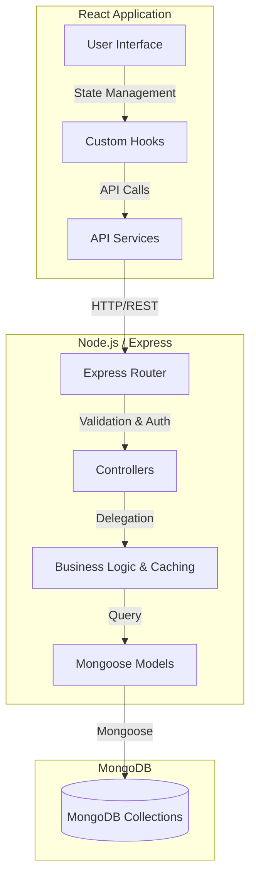

# EcoBuddy AI - Carbon Footprint Awareness Platform

Tagline: **Understand your impact. Reduce your footprint. Save the planet.**

## System Architecture



## Problem Statement

Most people lack visibility into how everyday choices contribute to carbon emissions. EcoBuddy AI turns activity data into measurable kg CO2e, highlights high-impact categories, and provides actionable reduction guidance through goals, recommendations, and reports.

## Features

- **Activity Tracking**: Log transport, electricity, food, water, and waste.
- **AI Recommendations**: Personalized tips to reduce emissions.
- **Goal Setting**: Set reduction targets and track progress.
- **Reporting**: Generate weekly and monthly analytics reports with PDF export.
- **Responsive Dashboard**: Real-time emission calculations and trends.
- **Security**: Robust rate limiting, Helmet, CORS, and XSS sanitization.
- **Performance**: Cached queries and database indexes.

## Setup Instructions

### Prerequisites
- Node.js (v20+)
- MongoDB (v6+)
- Docker & Docker Compose (optional, for containerized setup)

### Local Development Setup

1. **Clone the repository**
   ```bash
   git clone <repository-url>
   cd "Carbon Footprint Awareness Platform"
   ```

2. **Backend Setup**
   ```bash
   cd backend
   npm install
   # Create a .env file with your variables
   npm run dev
   ```

3. **Frontend Setup**
   ```bash
   cd frontend
   npm install
   npm run dev
   ```

4. **Access the application**
   Open your browser to `http://localhost:3000` (or the port defined by Vite).

### Docker Setup

To run the entire stack (Frontend, Backend, and MongoDB) using Docker Compose:

```bash
docker-compose up --build
```
The frontend will be available at `http://localhost:3000` and the backend at `http://localhost:5000`.

## Scripts

- `npm run lint` - Runs ESLint
- `npm run test` - Runs unit and integration tests
- `npm run test:coverage` - Generates test coverage reports

## License
MIT
